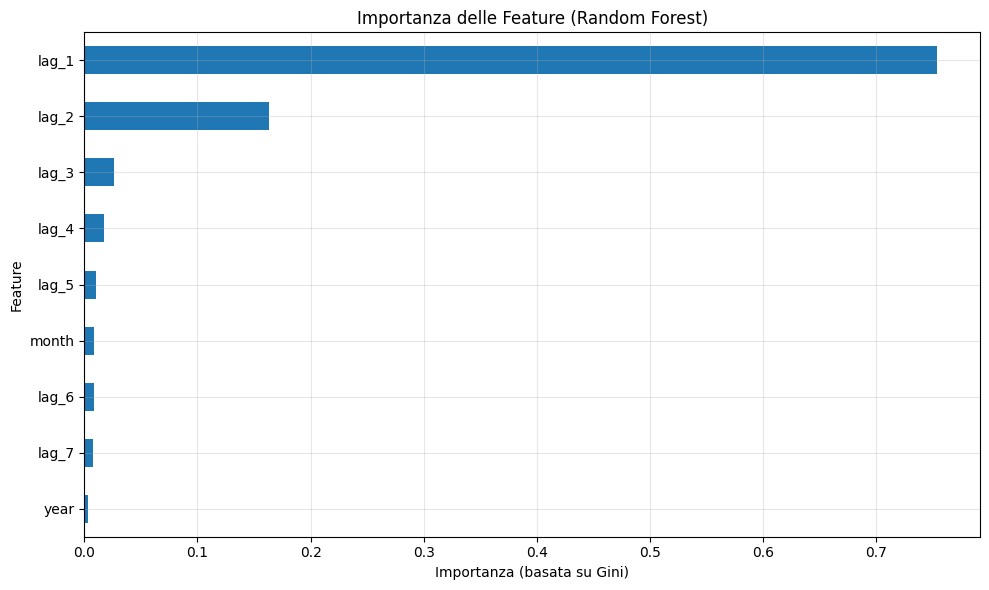
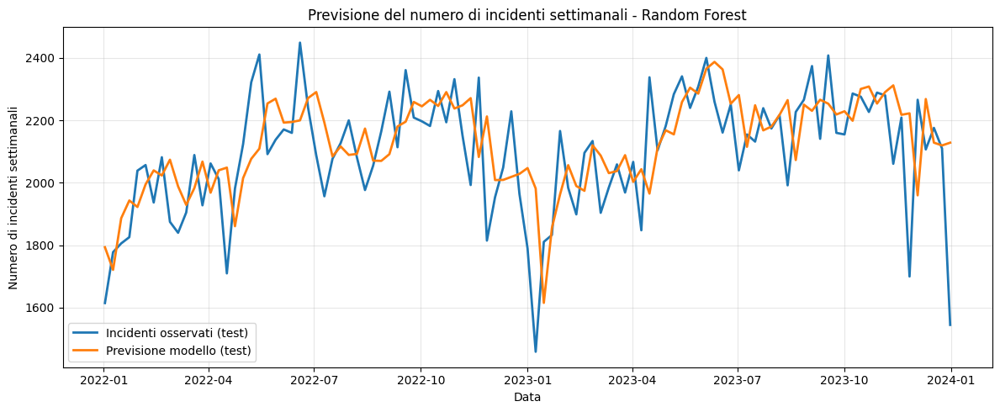
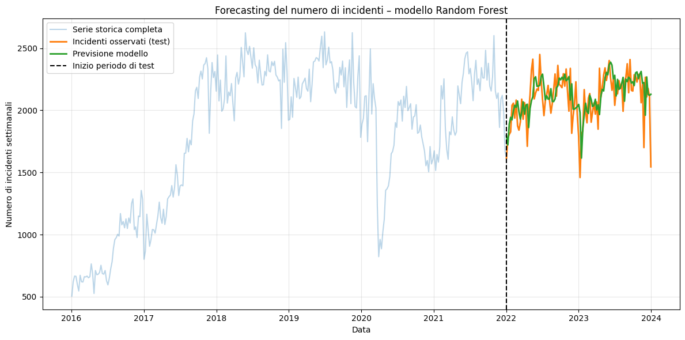
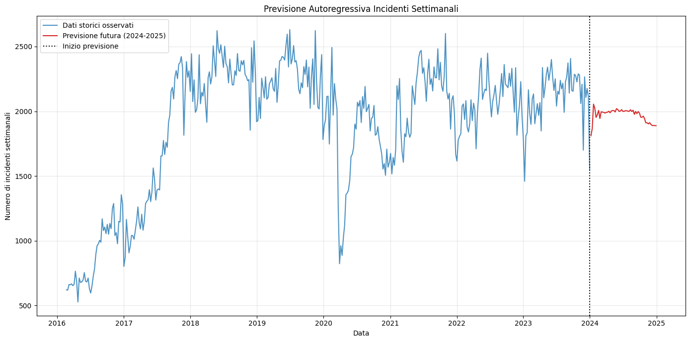

```python
# 1) Setup: librerie, connessione e lettura dati

import duckdb
import pandas as pd
import numpy as np
import matplotlib.pyplot as plt

from sklearn.ensemble import RandomForestRegressor
from sklearn.metrics import mean_absolute_error, mean_squared_error

con = duckdb.connect(database=':memory:') # connessione in-memory a un database DuckDB
```


```python
# caricamento del CSV del dataset in una tabella DuckDB
con.sql("""
    CREATE TABLE crashes_data AS
    SELECT * FROM read_csv_auto('Kaggle_traffic_accidents_dataset.csv')
""")
```


```python
# visualizzazione dei primi record come DataFrame Pandas
df = con.sql("SELECT * FROM crashes_data").df()
df.head() # mostra le prime 5 righe
```


<div>
<style scoped>
    .dataframe tbody tr th:only-of-type {
        vertical-align: middle;
    }

    .dataframe tbody tr th {
        vertical-align: top;
    }

    .dataframe thead th {
        text-align: right;
    }
</style>
<table border="1" class="dataframe">
  <thead>
    <tr style="text-align: right;">
      <th></th>
      <th>CRASH_RECORD_ID</th>
      <th>CRASH_DATE_EST_I</th>
      <th>CRASH_DATE</th>
      <th>POSTED_SPEED_LIMIT</th>
      <th>TRAFFIC_CONTROL_DEVICE</th>
      <th>DEVICE_CONDITION</th>
      <th>WEATHER_CONDITION</th>
      <th>LIGHTING_CONDITION</th>
      <th>FIRST_CRASH_TYPE</th>
      <th>TRAFFICWAY_TYPE</th>
      <th>...</th>
      <th>INJURIES_NON_INCAPACITATING</th>
      <th>INJURIES_REPORTED_NOT_EVIDENT</th>
      <th>INJURIES_NO_INDICATION</th>
      <th>INJURIES_UNKNOWN</th>
      <th>CRASH_HOUR</th>
      <th>CRASH_DAY_OF_WEEK</th>
      <th>CRASH_MONTH</th>
      <th>LATITUDE</th>
      <th>LONGITUDE</th>
      <th>LOCATION</th>
    </tr>
  </thead>
  <tbody>
    <tr>
      <th>0</th>
      <td>23a79931ef555d54118f64dc9be2cf2dbf59636ce253f7...</td>
      <td>None</td>
      <td>2023-09-05 19:05:00</td>
      <td>30</td>
      <td>TRAFFIC SIGNAL</td>
      <td>FUNCTIONING PROPERLY</td>
      <td>CLEAR</td>
      <td>DUSK</td>
      <td>ANGLE</td>
      <td>FIVE POINT, OR MORE</td>
      <td>...</td>
      <td>2</td>
      <td>0</td>
      <td>2</td>
      <td>0</td>
      <td>19</td>
      <td>3</td>
      <td>9</td>
      <td>NaN</td>
      <td>NaN</td>
      <td>None</td>
    </tr>
    <tr>
      <th>1</th>
      <td>2675c13fd0f474d730a5b780968b3cafc7c12d7adb661f...</td>
      <td>None</td>
      <td>2023-09-22 18:45:00</td>
      <td>50</td>
      <td>NO CONTROLS</td>
      <td>NO CONTROLS</td>
      <td>CLEAR</td>
      <td>DARKNESS, LIGHTED ROAD</td>
      <td>REAR END</td>
      <td>DIVIDED - W/MEDIAN BARRIER</td>
      <td>...</td>
      <td>0</td>
      <td>0</td>
      <td>2</td>
      <td>0</td>
      <td>18</td>
      <td>6</td>
      <td>9</td>
      <td>NaN</td>
      <td>NaN</td>
      <td>None</td>
    </tr>
    <tr>
      <th>2</th>
      <td>5f54a59fcb087b12ae5b1acff96a3caf4f2d37e79f8db4...</td>
      <td>None</td>
      <td>2023-07-29 14:45:00</td>
      <td>30</td>
      <td>TRAFFIC SIGNAL</td>
      <td>FUNCTIONING PROPERLY</td>
      <td>CLEAR</td>
      <td>DAYLIGHT</td>
      <td>PARKED MOTOR VEHICLE</td>
      <td>DIVIDED - W/MEDIAN (NOT RAISED)</td>
      <td>...</td>
      <td>0</td>
      <td>0</td>
      <td>1</td>
      <td>0</td>
      <td>14</td>
      <td>7</td>
      <td>7</td>
      <td>41.85412</td>
      <td>-87.665902</td>
      <td>POINT (-87.665902342962 41.854120262952)</td>
    </tr>
    <tr>
      <th>3</th>
      <td>7ebf015016f83d09b321afd671a836d6b148330535d5df...</td>
      <td>None</td>
      <td>2023-08-09 23:00:00</td>
      <td>30</td>
      <td>NO CONTROLS</td>
      <td>NO CONTROLS</td>
      <td>CLEAR</td>
      <td>DARKNESS, LIGHTED ROAD</td>
      <td>SIDESWIPE SAME DIRECTION</td>
      <td>NOT DIVIDED</td>
      <td>...</td>
      <td>0</td>
      <td>0</td>
      <td>2</td>
      <td>0</td>
      <td>23</td>
      <td>4</td>
      <td>8</td>
      <td>NaN</td>
      <td>NaN</td>
      <td>None</td>
    </tr>
    <tr>
      <th>4</th>
      <td>6c1659069e9c6285a650e70d6f9b574ed5f64c12888479...</td>
      <td>None</td>
      <td>2023-08-18 12:50:00</td>
      <td>15</td>
      <td>OTHER</td>
      <td>FUNCTIONING PROPERLY</td>
      <td>CLEAR</td>
      <td>DAYLIGHT</td>
      <td>REAR END</td>
      <td>OTHER</td>
      <td>...</td>
      <td>1</td>
      <td>0</td>
      <td>1</td>
      <td>0</td>
      <td>12</td>
      <td>6</td>
      <td>8</td>
      <td>NaN</td>
      <td>NaN</td>
      <td>None</td>
    </tr>
  </tbody>
</table>
<p>5 rows × 48 columns</p>
</div>


```python
# 2) Preparazione dati: estrapolazione, pulizia e ordinamento

# Conversione della colonna con la data dell'incidente
df['CRASH_DATE'] = pd.to_datetime(df['CRASH_DATE'], errors='coerce') # converte la colonna CRASH_DATE in un oggetto data/ora

# toglie le righe con data non valida, come le NaT (Not a Time) generate dell'opzione di sicurezza 'coerce'
df = df.dropna(subset=['CRASH_DATE']) 

df = df.sort_values('CRASH_DATE')
df.head()
```


<div>
<style scoped>
    .dataframe tbody tr th:only-of-type {
        vertical-align: middle;
    }

    .dataframe tbody tr th {
        vertical-align: top;
    }

    .dataframe thead th {
        text-align: right;
    }
</style>
<table border="1" class="dataframe">
  <thead>
    <tr style="text-align: right;">
      <th></th>
      <th>CRASH_RECORD_ID</th>
      <th>CRASH_DATE_EST_I</th>
      <th>CRASH_DATE</th>
      <th>POSTED_SPEED_LIMIT</th>
      <th>TRAFFIC_CONTROL_DEVICE</th>
      <th>DEVICE_CONDITION</th>
      <th>WEATHER_CONDITION</th>
      <th>LIGHTING_CONDITION</th>
      <th>FIRST_CRASH_TYPE</th>
      <th>TRAFFICWAY_TYPE</th>
      <th>...</th>
      <th>INJURIES_NON_INCAPACITATING</th>
      <th>INJURIES_REPORTED_NOT_EVIDENT</th>
      <th>INJURIES_NO_INDICATION</th>
      <th>INJURIES_UNKNOWN</th>
      <th>CRASH_HOUR</th>
      <th>CRASH_DAY_OF_WEEK</th>
      <th>CRASH_MONTH</th>
      <th>LATITUDE</th>
      <th>LONGITUDE</th>
      <th>LOCATION</th>
    </tr>
  </thead>
  <tbody>
    <tr>
      <th>535086</th>
      <td>a802658be15312809c771559e4f81088cfb226830792a5...</td>
      <td>None</td>
      <td>2013-03-03 16:48:00</td>
      <td>30</td>
      <td>TRAFFIC SIGNAL</td>
      <td>FUNCTIONING PROPERLY</td>
      <td>CLEAR</td>
      <td>DAYLIGHT</td>
      <td>SIDESWIPE OPPOSITE DIRECTION</td>
      <td>NOT DIVIDED</td>
      <td>...</td>
      <td>0</td>
      <td>2</td>
      <td>1</td>
      <td>0</td>
      <td>16</td>
      <td>1</td>
      <td>3</td>
      <td>41.975857</td>
      <td>-87.708744</td>
      <td>POINT (-87.708743641643 41.975856915535)</td>
    </tr>
    <tr>
      <th>115024</th>
      <td>19fb5af681f833c2af85734245f737fa6fbe62ac1ea379...</td>
      <td>None</td>
      <td>2013-06-01 20:29:00</td>
      <td>30</td>
      <td>NO CONTROLS</td>
      <td>NO CONTROLS</td>
      <td>CLEAR</td>
      <td>DARKNESS, LIGHTED ROAD</td>
      <td>PEDESTRIAN</td>
      <td>NOT DIVIDED</td>
      <td>...</td>
      <td>1</td>
      <td>0</td>
      <td>1</td>
      <td>0</td>
      <td>20</td>
      <td>7</td>
      <td>6</td>
      <td>42.005145</td>
      <td>-87.689969</td>
      <td>POINT (-87.689968732521 42.005144534455)</td>
    </tr>
    <tr>
      <th>765976</th>
      <td>f62e27317feb174811cf4fefeb9fa1064fea6c0619a873...</td>
      <td>None</td>
      <td>2014-01-18 18:14:00</td>
      <td>30</td>
      <td>NO CONTROLS</td>
      <td>NO CONTROLS</td>
      <td>CLEAR</td>
      <td>DUSK</td>
      <td>PARKED MOTOR VEHICLE</td>
      <td>DIVIDED - W/MEDIAN BARRIER</td>
      <td>...</td>
      <td>0</td>
      <td>0</td>
      <td>2</td>
      <td>0</td>
      <td>18</td>
      <td>7</td>
      <td>1</td>
      <td>41.885610</td>
      <td>-87.638756</td>
      <td>POINT (-87.638756189808 41.885609917063)</td>
    </tr>
    <tr>
      <th>480324</th>
      <td>957783a4787318f005a7dbc920e4c84cb9ac8aa7329a62...</td>
      <td>None</td>
      <td>2014-01-21 07:40:00</td>
      <td>30</td>
      <td>YIELD</td>
      <td>NO CONTROLS</td>
      <td>CLEAR</td>
      <td>DAYLIGHT</td>
      <td>ANGLE</td>
      <td>DIVIDED - W/MEDIAN (NOT RAISED)</td>
      <td>...</td>
      <td>1</td>
      <td>0</td>
      <td>1</td>
      <td>0</td>
      <td>7</td>
      <td>3</td>
      <td>1</td>
      <td>41.760710</td>
      <td>-87.561946</td>
      <td>POINT (-87.561946030143 41.760710194223)</td>
    </tr>
    <tr>
      <th>124001</th>
      <td>1d0232afecbdfd01968555aa956a688fd6f55a2bd1984f...</td>
      <td>None</td>
      <td>2014-02-24 19:45:00</td>
      <td>30</td>
      <td>TRAFFIC SIGNAL</td>
      <td>FUNCTIONING PROPERLY</td>
      <td>RAIN</td>
      <td>DAYLIGHT</td>
      <td>TURNING</td>
      <td>NOT DIVIDED</td>
      <td>...</td>
      <td>0</td>
      <td>0</td>
      <td>2</td>
      <td>0</td>
      <td>19</td>
      <td>2</td>
      <td>2</td>
      <td>41.884016</td>
      <td>-87.701143</td>
      <td>POINT (-87.701142757538 41.884016475152)</td>
    </tr>
  </tbody>
</table>
<p>5 rows × 48 columns</p>
</div>


```python
# 3) Costruzione della serie storica aggregata

# Granularità: settimanale
ts = (
    df.set_index('CRASH_DATE') # rende CRASH_DATE la colonna indice del DataFrame
      .resample('W') # raggruppa i dati secondo una freq. temporale ('W' = Weekly, con la domenica come termine di default)
      .size() # conta quanti incidenti ci sono in ciascun raggruppamento settimanale
      .rename('num_crashes') # rinomina la colonna del conteggio
      .to_frame() # riconversione in un DataFrame della singola colonna restituita da .size()
)

# riempie eventuali settimane senza incidenti con 0
ts['num_crashes'] = ts['num_crashes'].fillna(0)

ts.head()
```


<div>
<style scoped>
    .dataframe tbody tr th:only-of-type {
        vertical-align: middle;
    }

    .dataframe tbody tr th {
        vertical-align: top;
    }

    .dataframe thead th {
        text-align: right;
    }
</style>
<table border="1" class="dataframe">
  <thead>
    <tr style="text-align: right;">
      <th></th>
      <th>num_crashes</th>
    </tr>
    <tr>
      <th>CRASH_DATE</th>
      <th></th>
    </tr>
  </thead>
  <tbody>
    <tr>
      <th>2013-03-03</th>
      <td>1</td>
    </tr>
    <tr>
      <th>2013-03-10</th>
      <td>0</td>
    </tr>
    <tr>
      <th>2013-03-17</th>
      <td>0</td>
    </tr>
    <tr>
      <th>2013-03-24</th>
      <td>0</td>
    </tr>
    <tr>
      <th>2013-03-31</th>
      <td>0</td>
    </tr>
  </tbody>
</table>
</div>


```python
# 4) Definizionevv Split temporale per il Train/Test

# Selezione della finestra temporale di lavoro
ts = ts.loc['2016-01-01':'2023-12-31'] # .loc seleziona un sottoinsieme della serie storica

# Train: 2016–2021, Test: 2022–2023
split_date = '2022-01-01'

train_ts = ts.loc[:'2021-12-31']
test_ts  = ts.loc[split_date:]
```


```python
train_ts.head()
```


<div>
<style scoped>
    .dataframe tbody tr th:only-of-type {
        vertical-align: middle;
    }

    .dataframe tbody tr th {
        vertical-align: top;
    }

    .dataframe thead th {
        text-align: right;
    }
</style>
<table border="1" class="dataframe">
  <thead>
    <tr style="text-align: right;">
      <th></th>
      <th>num_crashes</th>
    </tr>
    <tr>
      <th>CRASH_DATE</th>
      <th></th>
    </tr>
  </thead>
  <tbody>
    <tr>
      <th>2016-01-03</th>
      <td>505</td>
    </tr>
    <tr>
      <th>2016-01-10</th>
      <td>621</td>
    </tr>
    <tr>
      <th>2016-01-17</th>
      <td>666</td>
    </tr>
    <tr>
      <th>2016-01-24</th>
      <td>664</td>
    </tr>
    <tr>
      <th>2016-01-31</th>
      <td>598</td>
    </tr>
  </tbody>
</table>
</div>


```python
test_ts.head()
```


<div>
<style scoped>
    .dataframe tbody tr th:only-of-type {
        vertical-align: middle;
    }

    .dataframe tbody tr th {
        vertical-align: top;
    }

    .dataframe thead th {
        text-align: right;
    }
</style>
<table border="1" class="dataframe">
  <thead>
    <tr style="text-align: right;">
      <th></th>
      <th>num_crashes</th>
    </tr>
    <tr>
      <th>CRASH_DATE</th>
      <th></th>
    </tr>
  </thead>
  <tbody>
    <tr>
      <th>2022-01-02</th>
      <td>1615</td>
    </tr>
    <tr>
      <th>2022-01-09</th>
      <td>1778</td>
    </tr>
    <tr>
      <th>2022-01-16</th>
      <td>1806</td>
    </tr>
    <tr>
      <th>2022-01-23</th>
      <td>1826</td>
    </tr>
    <tr>
      <th>2022-01-30</th>
      <td>2039</td>
    </tr>
  </tbody>
</table>
</div>


```python
# 5) Trasformazione della serie in un problema supervisionato con lag features

# Funzione helper per creare le features di lag e di calendario
def make_supervised(series, n_lags=7, freq='W'):
    
    # TARGET (output): colonna 'y' dei valori da prevedere
    df_sup = pd.DataFrame({'y': series}) # nuovo dataframe per la colonna target

    # FEATURES (input): colonne 'x' degli input da dare al modello durante l'addestramento
    # Lag features
    for lag in range(1, n_lags + 1):
        df_sup[f'lag_{lag}'] = df_sup['y'].shift(lag)

    # Features di calendario
    idx = df_sup.index
    df_sup['month'] = idx.month
    df_sup['year'] = idx.year

    df_sup = df_sup.dropna()
    return df_sup
```


```python
# Train + Test

supervised = make_supervised(ts['num_crashes'], n_lags=7, freq='W') # applica la funzione alla serie storica

# Esegue lo split train/test sul nuovo dataframe supervisionato
train_sup = supervised.loc[supervised.index < split_date]
test_sup  = supervised.loc[supervised.index >= split_date]

# Matrice delle Features (input) per l'addestramento (tutto train_sup tranne la colonna y)
X_train = train_sup.drop(columns=['y'])
# Vettore di Target (output) per l'addestramento (solo la colonna y)
y_train = train_sup['y']

# Stesse operazioni, ma per i set di test
X_test  = test_sup.drop(columns=['y'])
y_test  = test_sup['y']
```


```python
X_train.head()
```


<div>
<style scoped>
    .dataframe tbody tr th:only-of-type {
        vertical-align: middle;
    }

    .dataframe tbody tr th {
        vertical-align: top;
    }

    .dataframe thead th {
        text-align: right;
    }
</style>
<table border="1" class="dataframe">
  <thead>
    <tr style="text-align: right;">
      <th></th>
      <th>lag_1</th>
      <th>lag_2</th>
      <th>lag_3</th>
      <th>lag_4</th>
      <th>lag_5</th>
      <th>lag_6</th>
      <th>lag_7</th>
      <th>month</th>
      <th>year</th>
    </tr>
    <tr>
      <th>CRASH_DATE</th>
      <th></th>
      <th></th>
      <th></th>
      <th></th>
      <th></th>
      <th></th>
      <th></th>
      <th></th>
      <th></th>
    </tr>
  </thead>
  <tbody>
    <tr>
      <th>2016-02-21</th>
      <td>672.0</td>
      <td>546.0</td>
      <td>598.0</td>
      <td>664.0</td>
      <td>666.0</td>
      <td>621.0</td>
      <td>505.0</td>
      <td>2</td>
      <td>2016</td>
    </tr>
    <tr>
      <th>2016-02-28</th>
      <td>620.0</td>
      <td>672.0</td>
      <td>546.0</td>
      <td>598.0</td>
      <td>664.0</td>
      <td>666.0</td>
      <td>621.0</td>
      <td>2</td>
      <td>2016</td>
    </tr>
    <tr>
      <th>2016-03-06</th>
      <td>618.0</td>
      <td>620.0</td>
      <td>672.0</td>
      <td>546.0</td>
      <td>598.0</td>
      <td>664.0</td>
      <td>666.0</td>
      <td>3</td>
      <td>2016</td>
    </tr>
    <tr>
      <th>2016-03-13</th>
      <td>661.0</td>
      <td>618.0</td>
      <td>620.0</td>
      <td>672.0</td>
      <td>546.0</td>
      <td>598.0</td>
      <td>664.0</td>
      <td>3</td>
      <td>2016</td>
    </tr>
    <tr>
      <th>2016-03-20</th>
      <td>659.0</td>
      <td>661.0</td>
      <td>618.0</td>
      <td>620.0</td>
      <td>672.0</td>
      <td>546.0</td>
      <td>598.0</td>
      <td>3</td>
      <td>2016</td>
    </tr>
  </tbody>
</table>
</div>


```python
y_train.head()
```


    CRASH_DATE
    2016-02-21    620
    2016-02-28    618
    2016-03-06    661
    2016-03-13    659
    2016-03-20    666
    Freq: W-SUN, Name: y, dtype: int64


```python
supervised.head()
```


<div>
<style scoped>
    .dataframe tbody tr th:only-of-type {
        vertical-align: middle;
    }

    .dataframe tbody tr th {
        vertical-align: top;
    }

    .dataframe thead th {
        text-align: right;
    }
</style>
<table border="1" class="dataframe">
  <thead>
    <tr style="text-align: right;">
      <th></th>
      <th>y</th>
      <th>lag_1</th>
      <th>lag_2</th>
      <th>lag_3</th>
      <th>lag_4</th>
      <th>lag_5</th>
      <th>lag_6</th>
      <th>lag_7</th>
      <th>month</th>
      <th>year</th>
    </tr>
    <tr>
      <th>CRASH_DATE</th>
      <th></th>
      <th></th>
      <th></th>
      <th></th>
      <th></th>
      <th></th>
      <th></th>
      <th></th>
      <th></th>
      <th></th>
    </tr>
  </thead>
  <tbody>
    <tr>
      <th>2016-02-21</th>
      <td>620</td>
      <td>672.0</td>
      <td>546.0</td>
      <td>598.0</td>
      <td>664.0</td>
      <td>666.0</td>
      <td>621.0</td>
      <td>505.0</td>
      <td>2</td>
      <td>2016</td>
    </tr>
    <tr>
      <th>2016-02-28</th>
      <td>618</td>
      <td>620.0</td>
      <td>672.0</td>
      <td>546.0</td>
      <td>598.0</td>
      <td>664.0</td>
      <td>666.0</td>
      <td>621.0</td>
      <td>2</td>
      <td>2016</td>
    </tr>
    <tr>
      <th>2016-03-06</th>
      <td>661</td>
      <td>618.0</td>
      <td>620.0</td>
      <td>672.0</td>
      <td>546.0</td>
      <td>598.0</td>
      <td>664.0</td>
      <td>666.0</td>
      <td>3</td>
      <td>2016</td>
    </tr>
    <tr>
      <th>2016-03-13</th>
      <td>659</td>
      <td>661.0</td>
      <td>618.0</td>
      <td>620.0</td>
      <td>672.0</td>
      <td>546.0</td>
      <td>598.0</td>
      <td>664.0</td>
      <td>3</td>
      <td>2016</td>
    </tr>
    <tr>
      <th>2016-03-20</th>
      <td>666</td>
      <td>659.0</td>
      <td>661.0</td>
      <td>618.0</td>
      <td>620.0</td>
      <td>672.0</td>
      <td>546.0</td>
      <td>598.0</td>
      <td>3</td>
      <td>2016</td>
    </tr>
  </tbody>
</table>
</div>


```python
X_test.head()
```


<div>
<style scoped>
    .dataframe tbody tr th:only-of-type {
        vertical-align: middle;
    }

    .dataframe tbody tr th {
        vertical-align: top;
    }

    .dataframe thead th {
        text-align: right;
    }
</style>
<table border="1" class="dataframe">
  <thead>
    <tr style="text-align: right;">
      <th></th>
      <th>lag_1</th>
      <th>lag_2</th>
      <th>lag_3</th>
      <th>lag_4</th>
      <th>lag_5</th>
      <th>lag_6</th>
      <th>lag_7</th>
      <th>month</th>
      <th>year</th>
    </tr>
    <tr>
      <th>CRASH_DATE</th>
      <th></th>
      <th></th>
      <th></th>
      <th></th>
      <th></th>
      <th></th>
      <th></th>
      <th></th>
      <th></th>
    </tr>
  </thead>
  <tbody>
    <tr>
      <th>2022-01-02</th>
      <td>1667.0</td>
      <td>1985.0</td>
      <td>2120.0</td>
      <td>2090.0</td>
      <td>1862.0</td>
      <td>2139.0</td>
      <td>2095.0</td>
      <td>1</td>
      <td>2022</td>
    </tr>
    <tr>
      <th>2022-01-09</th>
      <td>1615.0</td>
      <td>1667.0</td>
      <td>1985.0</td>
      <td>2120.0</td>
      <td>2090.0</td>
      <td>1862.0</td>
      <td>2139.0</td>
      <td>1</td>
      <td>2022</td>
    </tr>
    <tr>
      <th>2022-01-16</th>
      <td>1778.0</td>
      <td>1615.0</td>
      <td>1667.0</td>
      <td>1985.0</td>
      <td>2120.0</td>
      <td>2090.0</td>
      <td>1862.0</td>
      <td>1</td>
      <td>2022</td>
    </tr>
    <tr>
      <th>2022-01-23</th>
      <td>1806.0</td>
      <td>1778.0</td>
      <td>1615.0</td>
      <td>1667.0</td>
      <td>1985.0</td>
      <td>2120.0</td>
      <td>2090.0</td>
      <td>1</td>
      <td>2022</td>
    </tr>
    <tr>
      <th>2022-01-30</th>
      <td>1826.0</td>
      <td>1806.0</td>
      <td>1778.0</td>
      <td>1615.0</td>
      <td>1667.0</td>
      <td>1985.0</td>
      <td>2120.0</td>
      <td>1</td>
      <td>2022</td>
    </tr>
  </tbody>
</table>
</div>


```python
y_test.head()
```


    CRASH_DATE
    2022-01-02    1615
    2022-01-09    1778
    2022-01-16    1806
    2022-01-23    1826
    2022-01-30    2039
    Freq: W-SUN, Name: y, dtype: int64


```python
# 6) Creazione modello, Addestramento e Previsione

rf = RandomForestRegressor(
    n_estimators=300, # numero di alberi decisionali
    random_state=42, # seme casuale per la riproducibilità imparziale dell'analisi
    n_jobs=-1 # permette l'uso di tutti i core della CPU per addestrare i 300 alberi in parallelo
)

rf.fit(X_train, y_train) # Training
y_pred = rf.predict(X_test) # Testing e calcolo delle previsioni
```


```python
df_pred = pd.DataFrame({
    'y_actual': y_test.values,
    'y_pred': y_pred
}, index=y_test.index)

df_pred.head()
```


<div>
<style scoped>
    .dataframe tbody tr th:only-of-type {
        vertical-align: middle;
    }

    .dataframe tbody tr th {
        vertical-align: top;
    }

    .dataframe thead th {
        text-align: right;
    }
</style>
<table border="1" class="dataframe">
  <thead>
    <tr style="text-align: right;">
      <th></th>
      <th>y_actual</th>
      <th>y_pred</th>
    </tr>
    <tr>
      <th>CRASH_DATE</th>
      <th></th>
      <th></th>
    </tr>
  </thead>
  <tbody>
    <tr>
      <th>2022-01-02</th>
      <td>1615</td>
      <td>1793.746667</td>
    </tr>
    <tr>
      <th>2022-01-09</th>
      <td>1778</td>
      <td>1721.363333</td>
    </tr>
    <tr>
      <th>2022-01-16</th>
      <td>1806</td>
      <td>1886.663333</td>
    </tr>
    <tr>
      <th>2022-01-23</th>
      <td>1826</td>
      <td>1943.440000</td>
    </tr>
    <tr>
      <th>2022-01-30</th>
      <td>2039</td>
      <td>1922.643333</td>
    </tr>
  </tbody>
</table>
</div>


```python
# 7) Valutazione del modello (metriche MAE / RMSE)
mae = mean_absolute_error(y_test, y_pred)
rmse = np.sqrt(mean_squared_error(y_test, y_pred))

print("MAE:", mae)
print("RMSE:", rmse)
```

    MAE: 125.56631746031746
    RMSE: 170.16897522585597
    


```python
# 7.1) Calcolo Baseline "Naive"

# Crea la previsione "naive": valore di questa settimana = valore della settimana precedente
y_pred_naive = y_test.shift(1)

# rimuove il primo valore  da entrambe le serie per allinearle
y_test_aligned = y_test.iloc[1:] # toglie il primo valore per avere una serie della stessa lunghezza di y_pred_naive_aligned
y_pred_naive_aligned = y_pred_naive.iloc[1:] # toglie il primo valore poichè è un NaN prodotto dallo shift(1)

# Calcola il MAE del modello "naive"
mae_naive = mean_absolute_error(y_test_aligned, y_pred_naive_aligned)

print(f"MAE Modello (Random Forest): {mae:.2f}")
print(f"MAE Baseline (Naive): {mae_naive:.2f}")

# Confronto
if mae < mae_naive:
    print("\nRISULTATO: Il modello Random Forest è migliore del baseline naive.")
    print(f"È più accurato di circa {mae_naive - mae:.2f} incidenti a settimana.")
else:
    print("\nATTENZIONE: Il modello Random Forest è peggiore (o uguale) del baseline naive.")
```

    MAE Modello (Random Forest): 125.57
    MAE Baseline (Naive): 152.87
    
    RISULTATO: Il modello Random Forest è migliore del baseline naive.
    È più accurato di circa 27.30 incidenti a settimana.
    


```python
# 7.2) Analisi Importanza Feature

# Estrae i contributi delle Features dal modello
importances = rf.feature_importances_
feature_names = X_train.columns # nomi delle features

# Crea una Series pandas per visualizzarle facilmente
feat_imp = pd.Series(importances, index=feature_names).sort_values()

# Crea il grafico
plt.figure(figsize=(10, 6))
feat_imp.plot(kind='barh', title='Importanza delle Feature (Random Forest)')
plt.xlabel('Importanza (basata su Gini)')
plt.ylabel('Feature')
plt.grid(alpha=0.3)
plt.tight_layout() # per non tagliare le etichette
plt.show()
```


    

    


```python
# Per comodità crea un nuovo dataframe che allinea per data i valori reali (y_actual) e i valori previsti (y_pred)
results = pd.DataFrame({
    'date': test_sup.index,
    'y_actual': y_test,
    'y_pred': y_pred
}).set_index('date')
results.head()
```


<div>
<style scoped>
    .dataframe tbody tr th:only-of-type {
        vertical-align: middle;
    }

    .dataframe tbody tr th {
        vertical-align: top;
    }

    .dataframe thead th {
        text-align: right;
    }
</style>
<table border="1" class="dataframe">
  <thead>
    <tr style="text-align: right;">
      <th></th>
      <th>y_actual</th>
      <th>y_pred</th>
    </tr>
    <tr>
      <th>date</th>
      <th></th>
      <th></th>
    </tr>
  </thead>
  <tbody>
    <tr>
      <th>2022-01-02</th>
      <td>1615</td>
      <td>1793.746667</td>
    </tr>
    <tr>
      <th>2022-01-09</th>
      <td>1778</td>
      <td>1721.363333</td>
    </tr>
    <tr>
      <th>2022-01-16</th>
      <td>1806</td>
      <td>1886.663333</td>
    </tr>
    <tr>
      <th>2022-01-23</th>
      <td>1826</td>
      <td>1943.440000</td>
    </tr>
    <tr>
      <th>2022-01-30</th>
      <td>2039</td>
      <td>1922.643333</td>
    </tr>
  </tbody>
</table>
</div>


```python
# 8) Grafici con matplotlib

# 8.1) Grafico col solo intervallo di Test
plt.figure(figsize=(12, 5))

plt.plot(results.index, results['y_actual'],
         label='Incidenti osservati (test)', linewidth=2)
plt.plot(results.index, results['y_pred'],
         label='Previsione modello (test)', linewidth=2)

plt.xlabel('Data')
plt.ylabel('Numero di incidenti settimanali')
plt.title('Previsione del numero di incidenti settimanali - Random Forest')
plt.legend()
plt.grid(alpha=0.3)
plt.tight_layout()
plt.show()
```


    

    


```python
# 8.2) Grafico con il contesto completo Train + Test

plt.figure(figsize=(12, 6))

plt.plot(ts.index, ts['num_crashes'],
         label='Serie storica completa', alpha=0.3)
plt.plot(results.index, results['y_actual'],
         label='Incidenti osservati (test)', linewidth=2)
plt.plot(results.index, results['y_pred'],
         label='Previsione modello', linewidth=2)

split_dt = pd.to_datetime(split_date)
plt.axvline(split_dt, linestyle='--', color='k', label='Inizio periodo di test')

plt.xlabel('Data')
plt.ylabel('Numero di incidenti settimanali')
plt.title('Forecasting del numero di incidenti – modello Random Forest')
plt.legend()
plt.grid(alpha=0.3)
plt.tight_layout()
plt.show()
```


    

    


```python
# 9) Allenamento del modello finale su tutti i dati (2016 - 2023)

# Usa l'intero dataframe 'supervised' creato in precedenza
X_final = supervised.drop(columns=['y'])
y_final = supervised['y']

# Crea e allena il modello finale
rf_final = RandomForestRegressor(
    n_estimators=300,
    random_state=42,
    n_jobs=-1
)

rf_final.fit(X_final, y_final)
```


<style>#sk-container-id-1 {
  /* Definition of color scheme common for light and dark mode */
  --sklearn-color-text: #000;
  --sklearn-color-text-muted: #666;
  --sklearn-color-line: gray;
  /* Definition of color scheme for unfitted estimators */
  --sklearn-color-unfitted-level-0: #fff5e6;
  --sklearn-color-unfitted-level-1: #f6e4d2;
  --sklearn-color-unfitted-level-2: #ffe0b3;
  --sklearn-color-unfitted-level-3: chocolate;
  /* Definition of color scheme for fitted estimators */
  --sklearn-color-fitted-level-0: #f0f8ff;
  --sklearn-color-fitted-level-1: #d4ebff;
  --sklearn-color-fitted-level-2: #b3dbfd;
  --sklearn-color-fitted-level-3: cornflowerblue;

  /* Specific color for light theme */
  --sklearn-color-text-on-default-background: var(--sg-text-color, var(--theme-code-foreground, var(--jp-content-font-color1, black)));
  --sklearn-color-background: var(--sg-background-color, var(--theme-background, var(--jp-layout-color0, white)));
  --sklearn-color-border-box: var(--sg-text-color, var(--theme-code-foreground, var(--jp-content-font-color1, black)));
  --sklearn-color-icon: #696969;

  @media (prefers-color-scheme: dark) {
    /* Redefinition of color scheme for dark theme */
    --sklearn-color-text-on-default-background: var(--sg-text-color, var(--theme-code-foreground, var(--jp-content-font-color1, white)));
    --sklearn-color-background: var(--sg-background-color, var(--theme-background, var(--jp-layout-color0, #111)));
    --sklearn-color-border-box: var(--sg-text-color, var(--theme-code-foreground, var(--jp-content-font-color1, white)));
    --sklearn-color-icon: #878787;
  }
}

#sk-container-id-1 {
  color: var(--sklearn-color-text);
}

#sk-container-id-1 pre {
  padding: 0;
}

#sk-container-id-1 input.sk-hidden--visually {
  border: 0;
  clip: rect(1px 1px 1px 1px);
  clip: rect(1px, 1px, 1px, 1px);
  height: 1px;
  margin: -1px;
  overflow: hidden;
  padding: 0;
  position: absolute;
  width: 1px;
}

#sk-container-id-1 div.sk-dashed-wrapped {
  border: 1px dashed var(--sklearn-color-line);
  margin: 0 0.4em 0.5em 0.4em;
  box-sizing: border-box;
  padding-bottom: 0.4em;
  background-color: var(--sklearn-color-background);
}

#sk-container-id-1 div.sk-container {
  /* jupyter's `normalize.less` sets `[hidden] { display: none; }`
     but bootstrap.min.css set `[hidden] { display: none !important; }`
     so we also need the `!important` here to be able to override the
     default hidden behavior on the sphinx rendered scikit-learn.org.
     See: https://github.com/scikit-learn/scikit-learn/issues/21755 */
  display: inline-block !important;
  position: relative;
}

#sk-container-id-1 div.sk-text-repr-fallback {
  display: none;
}

div.sk-parallel-item,
div.sk-serial,
div.sk-item {
  /* draw centered vertical line to link estimators */
  background-image: linear-gradient(var(--sklearn-color-text-on-default-background), var(--sklearn-color-text-on-default-background));
  background-size: 2px 100%;
  background-repeat: no-repeat;
  background-position: center center;
}

/* Parallel-specific style estimator block */

#sk-container-id-1 div.sk-parallel-item::after {
  content: "";
  width: 100%;
  border-bottom: 2px solid var(--sklearn-color-text-on-default-background);
  flex-grow: 1;
}

#sk-container-id-1 div.sk-parallel {
  display: flex;
  align-items: stretch;
  justify-content: center;
  background-color: var(--sklearn-color-background);
  position: relative;
}

#sk-container-id-1 div.sk-parallel-item {
  display: flex;
  flex-direction: column;
}

#sk-container-id-1 div.sk-parallel-item:first-child::after {
  align-self: flex-end;
  width: 50%;
}

#sk-container-id-1 div.sk-parallel-item:last-child::after {
  align-self: flex-start;
  width: 50%;
}

#sk-container-id-1 div.sk-parallel-item:only-child::after {
  width: 0;
}

/* Serial-specific style estimator block */

#sk-container-id-1 div.sk-serial {
  display: flex;
  flex-direction: column;
  align-items: center;
  background-color: var(--sklearn-color-background);
  padding-right: 1em;
  padding-left: 1em;
}


/* Toggleable style: style used for estimator/Pipeline/ColumnTransformer box that is
clickable and can be expanded/collapsed.
- Pipeline and ColumnTransformer use this feature and define the default style
- Estimators will overwrite some part of the style using the `sk-estimator` class
*/

/* Pipeline and ColumnTransformer style (default) */

#sk-container-id-1 div.sk-toggleable {
  /* Default theme specific background. It is overwritten whether we have a
  specific estimator or a Pipeline/ColumnTransformer */
  background-color: var(--sklearn-color-background);
}

/* Toggleable label */
#sk-container-id-1 label.sk-toggleable__label {
  cursor: pointer;
  display: flex;
  width: 100%;
  margin-bottom: 0;
  padding: 0.5em;
  box-sizing: border-box;
  text-align: center;
  align-items: start;
  justify-content: space-between;
  gap: 0.5em;
}

#sk-container-id-1 label.sk-toggleable__label .caption {
  font-size: 0.6rem;
  font-weight: lighter;
  color: var(--sklearn-color-text-muted);
}

#sk-container-id-1 label.sk-toggleable__label-arrow:before {
  /* Arrow on the left of the label */
  content: "▸";
  float: left;
  margin-right: 0.25em;
  color: var(--sklearn-color-icon);
}

#sk-container-id-1 label.sk-toggleable__label-arrow:hover:before {
  color: var(--sklearn-color-text);
}

/* Toggleable content - dropdown */

#sk-container-id-1 div.sk-toggleable__content {
  display: none;
  text-align: left;
  /* unfitted */
  background-color: var(--sklearn-color-unfitted-level-0);
}

#sk-container-id-1 div.sk-toggleable__content.fitted {
  /* fitted */
  background-color: var(--sklearn-color-fitted-level-0);
}

#sk-container-id-1 div.sk-toggleable__content pre {
  margin: 0.2em;
  border-radius: 0.25em;
  color: var(--sklearn-color-text);
  /* unfitted */
  background-color: var(--sklearn-color-unfitted-level-0);
}

#sk-container-id-1 div.sk-toggleable__content.fitted pre {
  /* unfitted */
  background-color: var(--sklearn-color-fitted-level-0);
}

#sk-container-id-1 input.sk-toggleable__control:checked~div.sk-toggleable__content {
  /* Expand drop-down */
  display: block;
  width: 100%;
  overflow: visible;
}

#sk-container-id-1 input.sk-toggleable__control:checked~label.sk-toggleable__label-arrow:before {
  content: "▾";
}

/* Pipeline/ColumnTransformer-specific style */

#sk-container-id-1 div.sk-label input.sk-toggleable__control:checked~label.sk-toggleable__label {
  color: var(--sklearn-color-text);
  background-color: var(--sklearn-color-unfitted-level-2);
}

#sk-container-id-1 div.sk-label.fitted input.sk-toggleable__control:checked~label.sk-toggleable__label {
  background-color: var(--sklearn-color-fitted-level-2);
}

/* Estimator-specific style */

/* Colorize estimator box */
#sk-container-id-1 div.sk-estimator input.sk-toggleable__control:checked~label.sk-toggleable__label {
  /* unfitted */
  background-color: var(--sklearn-color-unfitted-level-2);
}

#sk-container-id-1 div.sk-estimator.fitted input.sk-toggleable__control:checked~label.sk-toggleable__label {
  /* fitted */
  background-color: var(--sklearn-color-fitted-level-2);
}

#sk-container-id-1 div.sk-label label.sk-toggleable__label,
#sk-container-id-1 div.sk-label label {
  /* The background is the default theme color */
  color: var(--sklearn-color-text-on-default-background);
}

/* On hover, darken the color of the background */
#sk-container-id-1 div.sk-label:hover label.sk-toggleable__label {
  color: var(--sklearn-color-text);
  background-color: var(--sklearn-color-unfitted-level-2);
}

/* Label box, darken color on hover, fitted */
#sk-container-id-1 div.sk-label.fitted:hover label.sk-toggleable__label.fitted {
  color: var(--sklearn-color-text);
  background-color: var(--sklearn-color-fitted-level-2);
}

/* Estimator label */

#sk-container-id-1 div.sk-label label {
  font-family: monospace;
  font-weight: bold;
  display: inline-block;
  line-height: 1.2em;
}

#sk-container-id-1 div.sk-label-container {
  text-align: center;
}

/* Estimator-specific */
#sk-container-id-1 div.sk-estimator {
  font-family: monospace;
  border: 1px dotted var(--sklearn-color-border-box);
  border-radius: 0.25em;
  box-sizing: border-box;
  margin-bottom: 0.5em;
  /* unfitted */
  background-color: var(--sklearn-color-unfitted-level-0);
}

#sk-container-id-1 div.sk-estimator.fitted {
  /* fitted */
  background-color: var(--sklearn-color-fitted-level-0);
}

/* on hover */
#sk-container-id-1 div.sk-estimator:hover {
  /* unfitted */
  background-color: var(--sklearn-color-unfitted-level-2);
}

#sk-container-id-1 div.sk-estimator.fitted:hover {
  /* fitted */
  background-color: var(--sklearn-color-fitted-level-2);
}

/* Specification for estimator info (e.g. "i" and "?") */

/* Common style for "i" and "?" */

.sk-estimator-doc-link,
a:link.sk-estimator-doc-link,
a:visited.sk-estimator-doc-link {
  float: right;
  font-size: smaller;
  line-height: 1em;
  font-family: monospace;
  background-color: var(--sklearn-color-background);
  border-radius: 1em;
  height: 1em;
  width: 1em;
  text-decoration: none !important;
  margin-left: 0.5em;
  text-align: center;
  /* unfitted */
  border: var(--sklearn-color-unfitted-level-1) 1pt solid;
  color: var(--sklearn-color-unfitted-level-1);
}

.sk-estimator-doc-link.fitted,
a:link.sk-estimator-doc-link.fitted,
a:visited.sk-estimator-doc-link.fitted {
  /* fitted */
  border: var(--sklearn-color-fitted-level-1) 1pt solid;
  color: var(--sklearn-color-fitted-level-1);
}

/* On hover */
div.sk-estimator:hover .sk-estimator-doc-link:hover,
.sk-estimator-doc-link:hover,
div.sk-label-container:hover .sk-estimator-doc-link:hover,
.sk-estimator-doc-link:hover {
  /* unfitted */
  background-color: var(--sklearn-color-unfitted-level-3);
  color: var(--sklearn-color-background);
  text-decoration: none;
}

div.sk-estimator.fitted:hover .sk-estimator-doc-link.fitted:hover,
.sk-estimator-doc-link.fitted:hover,
div.sk-label-container:hover .sk-estimator-doc-link.fitted:hover,
.sk-estimator-doc-link.fitted:hover {
  /* fitted */
  background-color: var(--sklearn-color-fitted-level-3);
  color: var(--sklearn-color-background);
  text-decoration: none;
}

/* Span, style for the box shown on hovering the info icon */
.sk-estimator-doc-link span {
  display: none;
  z-index: 9999;
  position: relative;
  font-weight: normal;
  right: .2ex;
  padding: .5ex;
  margin: .5ex;
  width: min-content;
  min-width: 20ex;
  max-width: 50ex;
  color: var(--sklearn-color-text);
  box-shadow: 2pt 2pt 4pt #999;
  /* unfitted */
  background: var(--sklearn-color-unfitted-level-0);
  border: .5pt solid var(--sklearn-color-unfitted-level-3);
}

.sk-estimator-doc-link.fitted span {
  /* fitted */
  background: var(--sklearn-color-fitted-level-0);
  border: var(--sklearn-color-fitted-level-3);
}

.sk-estimator-doc-link:hover span {
  display: block;
}

/* "?"-specific style due to the `<a>` HTML tag */

#sk-container-id-1 a.estimator_doc_link {
  float: right;
  font-size: 1rem;
  line-height: 1em;
  font-family: monospace;
  background-color: var(--sklearn-color-background);
  border-radius: 1rem;
  height: 1rem;
  width: 1rem;
  text-decoration: none;
  /* unfitted */
  color: var(--sklearn-color-unfitted-level-1);
  border: var(--sklearn-color-unfitted-level-1) 1pt solid;
}

#sk-container-id-1 a.estimator_doc_link.fitted {
  /* fitted */
  border: var(--sklearn-color-fitted-level-1) 1pt solid;
  color: var(--sklearn-color-fitted-level-1);
}

/* On hover */
#sk-container-id-1 a.estimator_doc_link:hover {
  /* unfitted */
  background-color: var(--sklearn-color-unfitted-level-3);
  color: var(--sklearn-color-background);
  text-decoration: none;
}

#sk-container-id-1 a.estimator_doc_link.fitted:hover {
  /* fitted */
  background-color: var(--sklearn-color-fitted-level-3);
}

.estimator-table summary {
    padding: .5rem;
    font-family: monospace;
    cursor: pointer;
}

.estimator-table details[open] {
    padding-left: 0.1rem;
    padding-right: 0.1rem;
    padding-bottom: 0.3rem;
}

.estimator-table .parameters-table {
    margin-left: auto !important;
    margin-right: auto !important;
}

.estimator-table .parameters-table tr:nth-child(odd) {
    background-color: #fff;
}

.estimator-table .parameters-table tr:nth-child(even) {
    background-color: #f6f6f6;
}

.estimator-table .parameters-table tr:hover {
    background-color: #e0e0e0;
}

.estimator-table table td {
    border: 1px solid rgba(106, 105, 104, 0.232);
}

.user-set td {
    color:rgb(255, 94, 0);
    text-align: left;
}

.user-set td.value pre {
    color:rgb(255, 94, 0) !important;
    background-color: transparent !important;
}

.default td {
    color: black;
    text-align: left;
}

.user-set td i,
.default td i {
    color: black;
}

.copy-paste-icon {
    background-image: url(data:image/svg+xml;base64,PHN2ZyB4bWxucz0iaHR0cDovL3d3dy53My5vcmcvMjAwMC9zdmciIHZpZXdCb3g9IjAgMCA0NDggNTEyIj48IS0tIUZvbnQgQXdlc29tZSBGcmVlIDYuNy4yIGJ5IEBmb250YXdlc29tZSAtIGh0dHBzOi8vZm9udGF3ZXNvbWUuY29tIExpY2Vuc2UgLSBodHRwczovL2ZvbnRhd2Vzb21lLmNvbS9saWNlbnNlL2ZyZWUgQ29weXJpZ2h0IDIwMjUgRm9udGljb25zLCBJbmMuLS0+PHBhdGggZD0iTTIwOCAwTDMzMi4xIDBjMTIuNyAwIDI0LjkgNS4xIDMzLjkgMTQuMWw2Ny45IDY3LjljOSA5IDE0LjEgMjEuMiAxNC4xIDMzLjlMNDQ4IDMzNmMwIDI2LjUtMjEuNSA0OC00OCA0OGwtMTkyIDBjLTI2LjUgMC00OC0yMS41LTQ4LTQ4bDAtMjg4YzAtMjYuNSAyMS41LTQ4IDQ4LTQ4ek00OCAxMjhsODAgMCAwIDY0LTY0IDAgMCAyNTYgMTkyIDAgMC0zMiA2NCAwIDAgNDhjMCAyNi41LTIxLjUgNDgtNDggNDhMNDggNTEyYy0yNi41IDAtNDgtMjEuNS00OC00OEwwIDE3NmMwLTI2LjUgMjEuNS00OCA0OC00OHoiLz48L3N2Zz4=);
    background-repeat: no-repeat;
    background-size: 14px 14px;
    background-position: 0;
    display: inline-block;
    width: 14px;
    height: 14px;
    cursor: pointer;
}
</style><body><div id="sk-container-id-1" class="sk-top-container"><div class="sk-text-repr-fallback"><pre>RandomForestRegressor(n_estimators=300, n_jobs=-1, random_state=42)</pre><b>In a Jupyter environment, please rerun this cell to show the HTML representation or trust the notebook. <br />On GitHub, the HTML representation is unable to render, please try loading this page with nbviewer.org.</b></div><div class="sk-container" hidden><div class="sk-item"><div class="sk-estimator fitted sk-toggleable"><input class="sk-toggleable__control sk-hidden--visually" id="sk-estimator-id-1" type="checkbox" checked><label for="sk-estimator-id-1" class="sk-toggleable__label fitted sk-toggleable__label-arrow"><div><div>RandomForestRegressor</div></div><div><a class="sk-estimator-doc-link fitted" rel="noreferrer" target="_blank" href="https://scikit-learn.org/1.7/modules/generated/sklearn.ensemble.RandomForestRegressor.html">?<span>Documentation for RandomForestRegressor</span></a><span class="sk-estimator-doc-link fitted">i<span>Fitted</span></span></div></label><div class="sk-toggleable__content fitted" data-param-prefix="">
        <div class="estimator-table">
            <details>
                <summary>Parameters</summary>
                <table class="parameters-table">
                  <tbody>

        <tr class="user-set">
            <td><i class="copy-paste-icon"
                 onclick="copyToClipboard('n_estimators',
                          this.parentElement.nextElementSibling)"
            ></i></td>
            <td class="param">n_estimators&nbsp;</td>
            <td class="value">300</td>
        </tr>


        <tr class="default">
            <td><i class="copy-paste-icon"
                 onclick="copyToClipboard('criterion',
                          this.parentElement.nextElementSibling)"
            ></i></td>
            <td class="param">criterion&nbsp;</td>
            <td class="value">&#x27;squared_error&#x27;</td>
        </tr>


        <tr class="default">
            <td><i class="copy-paste-icon"
                 onclick="copyToClipboard('max_depth',
                          this.parentElement.nextElementSibling)"
            ></i></td>
            <td class="param">max_depth&nbsp;</td>
            <td class="value">None</td>
        </tr>


        <tr class="default">
            <td><i class="copy-paste-icon"
                 onclick="copyToClipboard('min_samples_split',
                          this.parentElement.nextElementSibling)"
            ></i></td>
            <td class="param">min_samples_split&nbsp;</td>
            <td class="value">2</td>
        </tr>


        <tr class="default">
            <td><i class="copy-paste-icon"
                 onclick="copyToClipboard('min_samples_leaf',
                          this.parentElement.nextElementSibling)"
            ></i></td>
            <td class="param">min_samples_leaf&nbsp;</td>
            <td class="value">1</td>
        </tr>


        <tr class="default">
            <td><i class="copy-paste-icon"
                 onclick="copyToClipboard('min_weight_fraction_leaf',
                          this.parentElement.nextElementSibling)"
            ></i></td>
            <td class="param">min_weight_fraction_leaf&nbsp;</td>
            <td class="value">0.0</td>
        </tr>


        <tr class="default">
            <td><i class="copy-paste-icon"
                 onclick="copyToClipboard('max_features',
                          this.parentElement.nextElementSibling)"
            ></i></td>
            <td class="param">max_features&nbsp;</td>
            <td class="value">1.0</td>
        </tr>


        <tr class="default">
            <td><i class="copy-paste-icon"
                 onclick="copyToClipboard('max_leaf_nodes',
                          this.parentElement.nextElementSibling)"
            ></i></td>
            <td class="param">max_leaf_nodes&nbsp;</td>
            <td class="value">None</td>
        </tr>


        <tr class="default">
            <td><i class="copy-paste-icon"
                 onclick="copyToClipboard('min_impurity_decrease',
                          this.parentElement.nextElementSibling)"
            ></i></td>
            <td class="param">min_impurity_decrease&nbsp;</td>
            <td class="value">0.0</td>
        </tr>


        <tr class="default">
            <td><i class="copy-paste-icon"
                 onclick="copyToClipboard('bootstrap',
                          this.parentElement.nextElementSibling)"
            ></i></td>
            <td class="param">bootstrap&nbsp;</td>
            <td class="value">True</td>
        </tr>


        <tr class="default">
            <td><i class="copy-paste-icon"
                 onclick="copyToClipboard('oob_score',
                          this.parentElement.nextElementSibling)"
            ></i></td>
            <td class="param">oob_score&nbsp;</td>
            <td class="value">False</td>
        </tr>


        <tr class="user-set">
            <td><i class="copy-paste-icon"
                 onclick="copyToClipboard('n_jobs',
                          this.parentElement.nextElementSibling)"
            ></i></td>
            <td class="param">n_jobs&nbsp;</td>
            <td class="value">-1</td>
        </tr>


        <tr class="user-set">
            <td><i class="copy-paste-icon"
                 onclick="copyToClipboard('random_state',
                          this.parentElement.nextElementSibling)"
            ></i></td>
            <td class="param">random_state&nbsp;</td>
            <td class="value">42</td>
        </tr>


        <tr class="default">
            <td><i class="copy-paste-icon"
                 onclick="copyToClipboard('verbose',
                          this.parentElement.nextElementSibling)"
            ></i></td>
            <td class="param">verbose&nbsp;</td>
            <td class="value">0</td>
        </tr>


        <tr class="default">
            <td><i class="copy-paste-icon"
                 onclick="copyToClipboard('warm_start',
                          this.parentElement.nextElementSibling)"
            ></i></td>
            <td class="param">warm_start&nbsp;</td>
            <td class="value">False</td>
        </tr>


        <tr class="default">
            <td><i class="copy-paste-icon"
                 onclick="copyToClipboard('ccp_alpha',
                          this.parentElement.nextElementSibling)"
            ></i></td>
            <td class="param">ccp_alpha&nbsp;</td>
            <td class="value">0.0</td>
        </tr>


        <tr class="default">
            <td><i class="copy-paste-icon"
                 onclick="copyToClipboard('max_samples',
                          this.parentElement.nextElementSibling)"
            ></i></td>
            <td class="param">max_samples&nbsp;</td>
            <td class="value">None</td>
        </tr>


        <tr class="default">
            <td><i class="copy-paste-icon"
                 onclick="copyToClipboard('monotonic_cst',
                          this.parentElement.nextElementSibling)"
            ></i></td>
            <td class="param">monotonic_cst&nbsp;</td>
            <td class="value">None</td>
        </tr>

                  </tbody>
                </table>
            </details>
        </div>
    </div></div></div></div></div><script>function copyToClipboard(text, element) {
    // Get the parameter prefix from the closest toggleable content
    const toggleableContent = element.closest('.sk-toggleable__content');
    const paramPrefix = toggleableContent ? toggleableContent.dataset.paramPrefix : '';
    const fullParamName = paramPrefix ? `${paramPrefix}${text}` : text;

    const originalStyle = element.style;
    const computedStyle = window.getComputedStyle(element);
    const originalWidth = computedStyle.width;
    const originalHTML = element.innerHTML.replace('Copied!', '');

    navigator.clipboard.writeText(fullParamName)
        .then(() => {
            element.style.width = originalWidth;
            element.style.color = 'green';
            element.innerHTML = "Copied!";

            setTimeout(() => {
                element.innerHTML = originalHTML;
                element.style = originalStyle;
            }, 2000);
        })
        .catch(err => {
            console.error('Failed to copy:', err);
            element.style.color = 'red';
            element.innerHTML = "Failed!";
            setTimeout(() => {
                element.innerHTML = originalHTML;
                element.style = originalStyle;
            }, 2000);
        });
    return false;
}

document.querySelectorAll('.fa-regular.fa-copy').forEach(function(element) {
    const toggleableContent = element.closest('.sk-toggleable__content');
    const paramPrefix = toggleableContent ? toggleableContent.dataset.paramPrefix : '';
    const paramName = element.parentElement.nextElementSibling.textContent.trim();
    const fullParamName = paramPrefix ? `${paramPrefix}${paramName}` : paramName;

    element.setAttribute('title', fullParamName);
});
</script></body>


```python
# 10) Generazione della previsione autoregressiva

N_LAGS = 7          # stesso n_lags usato prima
N_FORECAST = 52     # numero di settimane da prevedere (circa 1 anno)

# Prende gli ultimi lag reali per iniziare la previsione
history_lags = y_final.iloc[-N_LAGS:].tolist()

# Crea l'indice di date per il futuro
last_real_date = y_final.index[-1]
future_dates = pd.date_range(
    start=last_real_date + pd.Timedelta(weeks=1),
    periods=N_FORECAST,
    freq='W'
)

# Lista per salvare le previsioni
future_forecasts = []

print(f"Inizio previsione autoregressiva per {N_FORECAST} settimane...")

for current_date in future_dates:
    # 1- Costruisce le features per la data corrente
    features = {}
    for i in range(1, N_LAGS + 1):
        features[f'lag_{i}'] = history_lags[-i]
    features['month'] = current_date.month
    features['year'] = current_date.year

    # 2- Crea un dataframe per la previsione
    X_new = pd.DataFrame(features, index=[current_date])
    X_new = X_new[X_final.columns] 

    # 3- Previsione
    new_pred = rf_final.predict(X_new)[0] # [0] per estrarre il singolo valore

    # 4- Salva la previsione e aggiorna la history
    future_forecasts.append(new_pred)
    history_lags.append(new_pred) # La previsione diventa 'storia'
    history_lags = history_lags[-N_LAGS:] # Mantiene solo gli ultimi 7 valori

print("Previsione completata.")
```

    Inizio previsione autoregressiva per 52 settimane...
    Previsione completata.
    


```python
# 11) Grafico della previsione futura (numero di incidenti nel 2024)

# Trasforma le previsioni in una Series Pandas per costruire più facilmente il grafico
s_forecast = pd.Series(future_forecasts, index=future_dates)

plt.figure(figsize=(14, 7))

plt.plot(y_final, label='Dati storici osservati', color='C0', alpha=0.8) # Dati storici
plt.plot(s_forecast, label='Previsione futura (2024-2025)', color='C3', linestyle='-') # Previsione futura
plt.axvline(last_real_date, linestyle=':', color='k', label='Inizio previsione')

plt.title('Previsione Autoregressiva Incidenti Settimanali')
plt.ylabel('Numero di incidenti settimanali')
plt.xlabel('Data')
plt.legend()
plt.grid(alpha=0.3)
plt.tight_layout()
plt.show()
```


    

    

